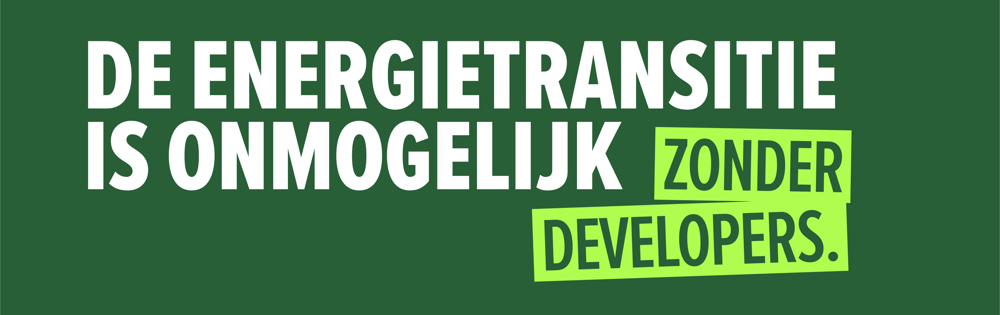

# Welkom bij Alliander

Deze github-org is bedoeld voor Alliander medewerkers.

Ben je geen Alliander collega, maar wil je er wel een worden? Wij hebben wel 100 goede redenen waarom je dat zou moeten doen! Hieronder lichten we er een paar voor je uit 👇

💻 #100 Digitalisering van de energietransitie

💰 #12 Goede secundaire arbeidsvoorwaarden

🏠 #98 Thuiswerken wanneer je wilt

🖱 #03 Innoveren door hackatons

📚 #63 Ontwikkelen tot specialist

⚡ #94 Werken aan het energienet van de toekomst

Alle vacatures voor de functie developer vind je hier👉  https://werkenbij.alliander.com/vacatures/?q=developer

Kijk voor de Open Source initiatieven van Alliander hier👉 https://github.com/alliander-opensource

